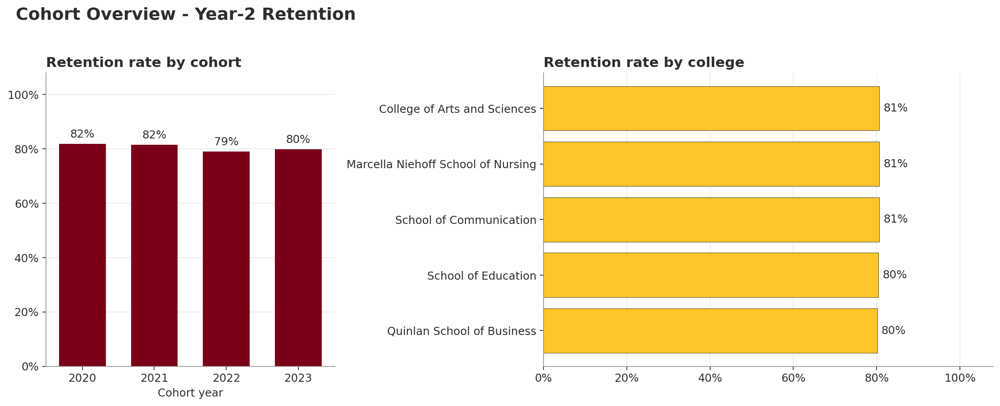
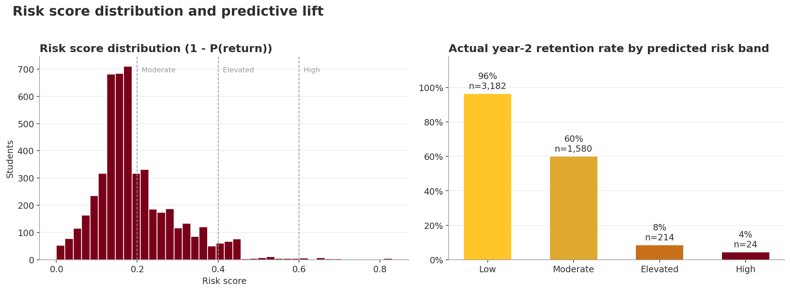
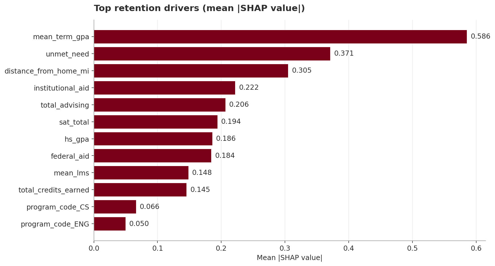
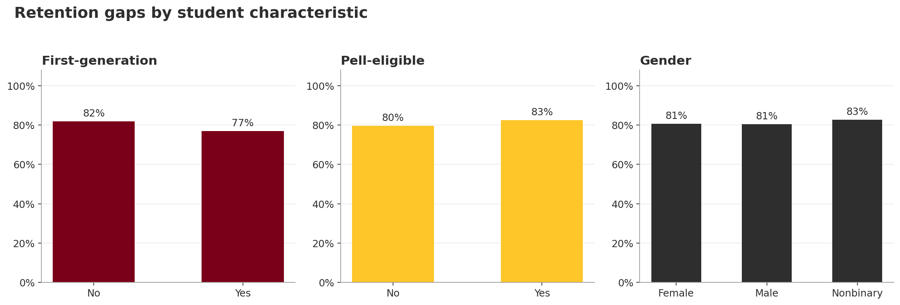
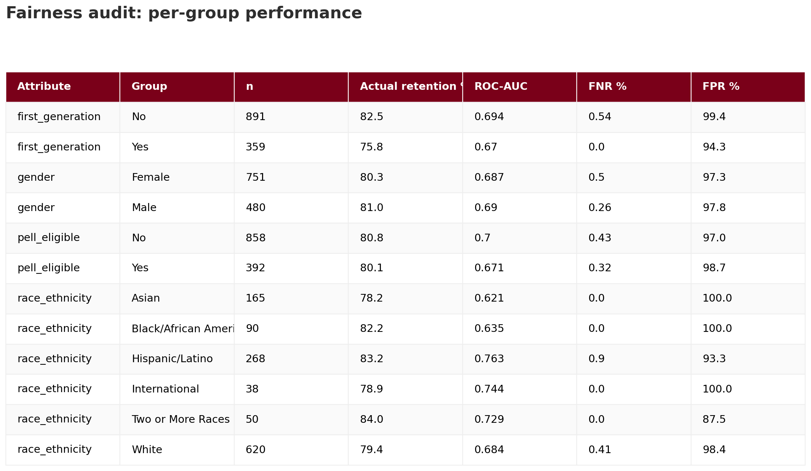

# Student Success Analytics

[](https://github.com/dhavig/student-success-analytics/actions/workflows/ci.yml)

End-to-end institutional research analytics platform: synthetic student data → warehouse → predictive retention model → interactive dashboard.

Built as a portfolio project aligned to the Senior Data Scientist role at Loyola University Chicago's Office of Institutional Research & Analysis.



## What's inside

| Layer | Tech | Purpose |
|---|---|---|
| **Data engineering** | Python, DuckDB, SQL | Generates synthetic student records, course evaluations, and loads them into a star-schema warehouse. |
| **Advanced analytics** | scikit-learn, XGBoost, SHAP | First-year retention risk model with explainability and a fairness audit across demographic slices. |
| **Survey + unstructured text** | VADER, scikit-learn LDA | Sentiment + topic modeling on synthetic course-evaluation comments; cross-linked to retention outcome. |
| **Business intelligence** | Streamlit, Plotly, Tableau Public | Interactive 4-tab Streamlit dashboard, plus a Tableau Public companion (see `docs/TABLEAU_GUIDE.md`). |
| **Teaching artifact** | Jupyter | `notebooks/01_ir_memo_walkthrough.ipynb` — the analytic pattern written as an IR memo for analyst cross-training. |
| **Documentation** | Markdown | README case study + Model Card describing assumptions, metrics, and responsible-use guidance. |

## Project structure

```
student-success-analytics/
├── etl/
│   ├── generate_data.py            # Synthetic student/enrollment/aid generator
│   ├── generate_evaluations.py     # Synthetic course-eval comments + ratings
│   └── load_warehouse.py           # Builds DuckDB star schema and loads data
├── sql/
│   ├── schema.sql                  # Star schema DDL (fact + dim tables)
│   └── analytics_queries.sql       # 8 reference IR-style analytic queries
├── models/
│   └── train_retention.py          # XGBoost model + SHAP + fairness audit
├── nlp/
│   └── analyze_evaluations.py      # VADER sentiment + LDA topics on comments
├── dashboard/
│   └── app.py                      # Streamlit dashboard (4 tabs)
├── notebooks/
│   └── 01_ir_memo_walkthrough.ipynb  # IR-memo-style teaching notebook
├── scripts/
│   ├── render_screenshots.py       # Render README gallery PNGs
│   ├── export_for_tableau.py       # Denormalized CSV for Tableau Public
│   └── build_notebook.py           # Programmatic notebook builder
├── tests/                          # pytest suite (ETL, model, NLP, dashboard)
├── .github/workflows/ci.yml        # CI: tests + end-to-end pipeline run
├── data/                           # Generated CSVs and DuckDB file (gitignored)
├── artifacts/                      # Trained model, plots, metrics (gitignored)
├── docs/                           # README screenshots + TABLEAU_GUIDE.md
├── MODEL_CARD.md
├── requirements.txt
└── README.md
```

## Quick start

```bash
# 1. Create environment
python -m venv .venv
source .venv/bin/activate          # Windows: .venv\Scripts\activate
pip install -r requirements.txt

# 2. Generate synthetic data and build the warehouse
python etl/generate_data.py
python etl/generate_evaluations.py     # synthetic course-eval comments
python etl/load_warehouse.py

# 3. Train the retention model and run the NLP layer
python models/train_retention.py
python nlp/analyze_evaluations.py

# 4. Launch the dashboard (4 tabs)
streamlit run dashboard/app.py

# 5. Optional: export for Tableau Public companion (see docs/TABLEAU_GUIDE.md)
python scripts/export_for_tableau.py
```

## Case study: First-year retention risk

**Business question.** Which first-year students are at elevated risk of not returning for their second year, and what factors are driving that risk?

**Approach.**
1. Generate a realistic synthetic cohort (~5,000 students) modeled on a mid-sized private university — demographics, academic preparation, financial aid, first-term GPA, engagement signals.
2. Load into a DuckDB star schema (`fact_term_enrollment`, `dim_student`, `dim_program`, `dim_term`).
3. Train a gradient-boosted classifier predicting `returned_year_2`. Evaluate with ROC-AUC, PR-AUC, and calibration.
4. Explain individual predictions with SHAP. Audit subgroup performance (gender, first-generation status, Pell eligibility, race/ethnicity) for parity.
5. Surface results in a dashboard with four views: leadership summary, advisor outreach list, voice of student (NLP), and model transparency.

**Why this matters for Loyola IR.** This mirrors a real-world OIRA workflow — translating warehoused student data into both strategic insight (cohort dashboards) and operational impact (risk-flagged students for advisor outreach), with the responsible-AI guardrails the role explicitly calls out.

## Gallery

**Predictive lift.** The four-tier risk band cleanly separates retained from non-retained students; the High band has a 4% second-year retention rate vs. 96% in the Low band — that's the operational signal advisors need.



**Top retention drivers.** First-term GPA dominates, followed by financial pressure (`unmet_need`), residential context (`distance_from_home_mi`), and institutional aid. Advising touch and LMS engagement also rank meaningfully.



**Equity gaps.** A five-point first-generation gap (82% vs. 77%) is the kind of finding an IR analyst would surface for the provost's office.



**Fairness audit.** Per-group ROC-AUC, false negative rate, and false positive rate across protected attributes — the starting point for any responsible deployment review.



**Voice of student.** Synthetic course-evaluation comments scored with VADER sentiment and clustered into 6 topics via LDA. Students writing very-negative comments retain at ~55% vs. ~90% for positive-sentiment peers — a text signal a numeric warehouse alone misses.

| Sentiment band | Students | Year-2 retention |
|---|---:|---:|
| Very Negative | ~170 | 55% |
| Slightly Negative | ~940 | 65% |
| Slightly Positive | ~1,400 | 78% |
| Positive | ~2,500 | 90% |

## Testing & CI

30 pytest tests cover the data generator, warehouse loader, retention model, NLP pipeline, and dashboard module:

```bash
pytest -q
```

GitHub Actions runs the same suite plus the full end-to-end pipeline (generate → load → train → render screenshots) on every push. See `.github/workflows/ci.yml`.

Notable invariants the tests enforce:

- Protected attributes (gender, race, first-generation, Pell) are never used as model features — only for the fairness audit.
- The warehouse contains no PII columns (`first_name`, `last_name`).
- Referential integrity holds across all fact-to-dim joins.
- The trained model beats a majority-class baseline.

## Responsible use

All data here is synthetic. The fairness audit in `models/train_retention.py` is a starting point, not a sign-off; in production any retention-risk model would require Title IX, FERPA, and IRB review, ongoing drift monitoring, and a human-in-the-loop intervention design. See `MODEL_CARD.md`.

## License

MIT — for portfolio and educational use.

